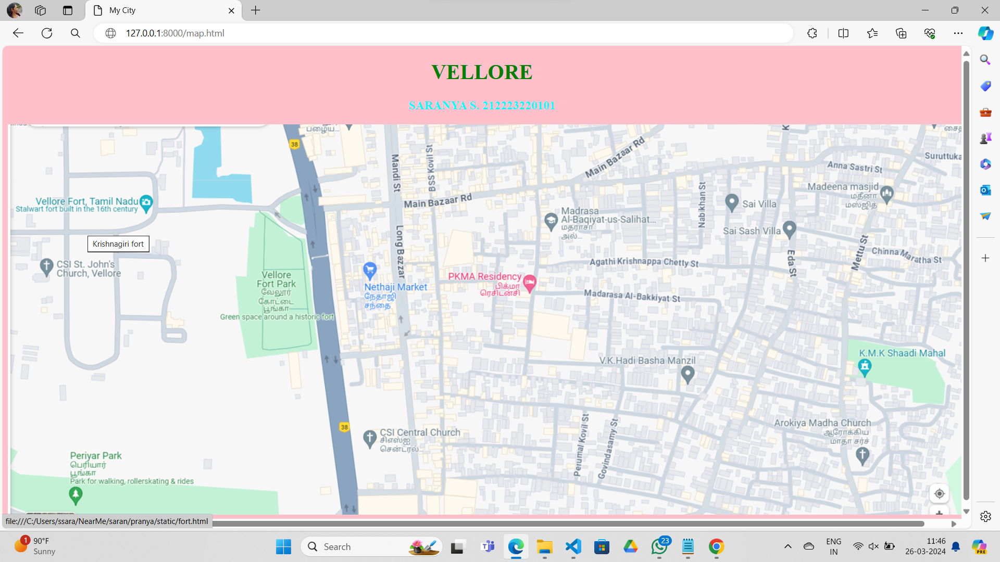
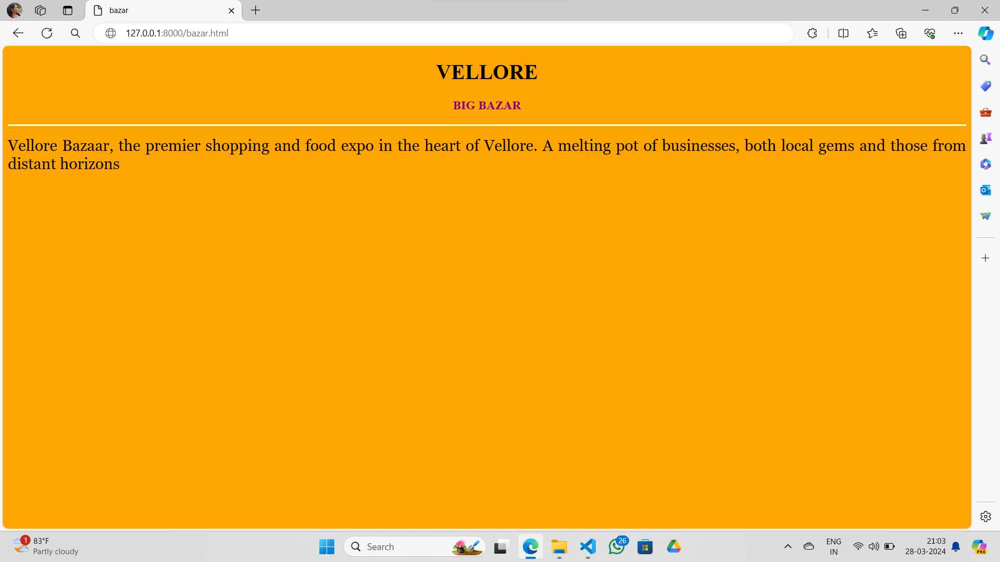
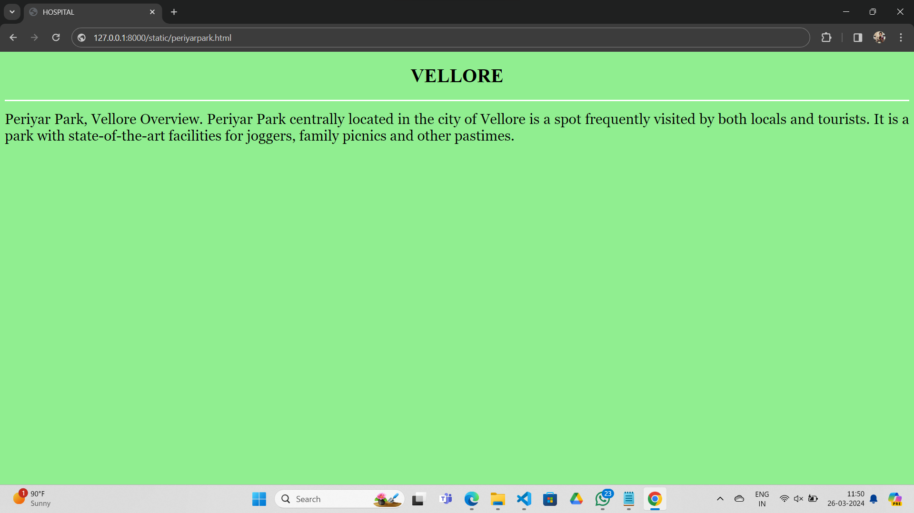
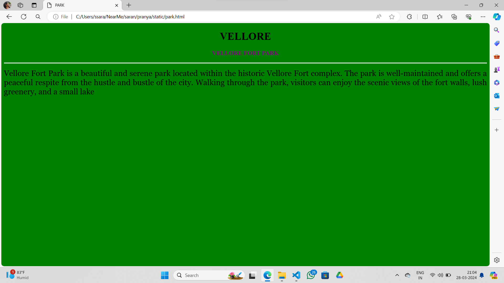
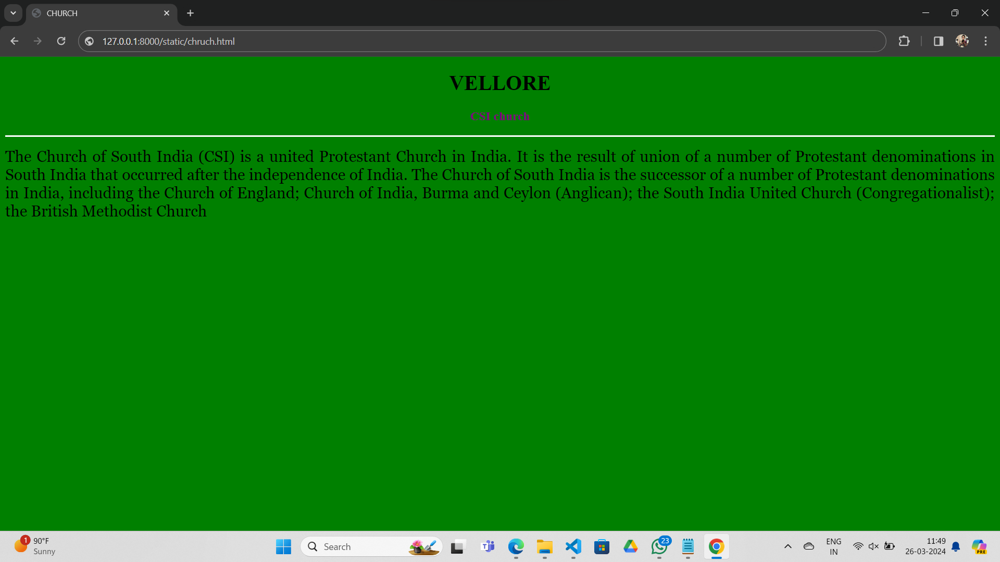
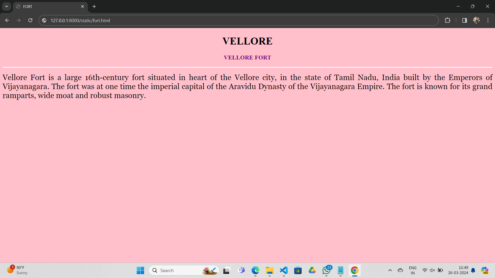

# Ex04 Places Around Me
## Date: 

## AIM
To develop a website to display details about the places around my house.

## DESIGN STEPS

### STEP 1
Create a Django admin interface.

### STEP 2
Download your city map from Google.

### STEP 3
Using ```<map>``` tag name the map.

### STEP 4
Create clickable regions in the image using ```<area>``` tag.

### STEP 5
Write HTML programs for all the regions identified.

### STEP 6
Execute the programs and publish them.

## CODE
```
map.html
<!DOCTYPE html>
<html lang="en">
<head>
<title>My City</title>
</head>
<body bgcolor="pink">
<h1 align="center">
<font color="green"><b>VELLORE</b></font>
</h1>
<h3 align="center">
<font color="cyan"><b>SARANYA S. 212223220101</b></font>
</h3>
<center>

<map name="MyCity">
<area shape="rectangle" coords="0,0,200,200" href="fort.html"  title="Krishnagiri fort">
<area shape="rectangle" coords=,"114,130,750,760" href="church.html" title="SV residency">
<area shape="rectangle" coords="1233,349,1233,233" href="park.html" title=" Pet hotel">
<area shape="rectangle" coords="122,3940,2223,200" href="periyarpark.html" title=" Nanda hospital">
<area shape="rectangle" coords="188,3947,2345,1233" href="bazar.html" title="Sports society">
</map>
</center>
</body>
</html>

bazar.html

<!DOCTYPE html>
<html lang="en">
    <head>
        <title>CHURCH</title>
    </head>
    <body bgcolor="orange">
    <h1 align="center">
    <font color="black"><b>VELLORE</b></font>
    </h1>
    <h3 align="center">
    <font color="purple"><b>CSI church</b></font>
    </h3>
    <hr size="3" color="white">
    <p align="justify">
    <font face="Georgia" size="5">
        Vellore Bazaar, the premier shopping and food expo in the heart of Vellore. A melting pot of businesses, both local gems and those from distant horizons
    </p>
    </body>
</html>

periyar.html
<!DOCTYPE html>
<html lang="en">
    <head>
        <title>HOSPITAL</title>
    </head>
    <body bgcolor="lightgreen">
    <h1 align="center">
    <font color="black"><b>VELLORE</b></font>
    </h1>
    <h3 align="center">
    <font color="purple"><b></b></font>
    </h3>
    <hr size="3" color="white">
    <p align="justify">
    <font face="Georgia" size="5">
        Periyar Park, Vellore Overview. Periyar Park centrally located in the city of Vellore is a spot frequently visited by both locals and tourists. It is a park with state-of-the-art facilities for joggers, family picnics and other pastimes.
    </p>
    </body>
</html>

park.html

<!DOCTYPE html>
<html lang="en">
    <head>
        <title>PARK</title>
    </head>
    <body bgcolor="green">
    <h1 align="center">
    <font color="black"><b>VELLORE</b></font>
    </h1>
    <h3 align="center">
    <font color="purple"><b>VELLORE FORT PARK</b></font>
    </h3>
    <hr size="3" color="white">
    <p align="justify">
    <font face="Georgia" size="5">
        Vellore Fort Park is a beautiful and serene park located within the historic Vellore Fort complex. The park is well-maintained and offers a peaceful respite from the hustle and bustle of the
         city. Walking through the park, visitors can enjoy the scenic views of the fort walls, lush greenery, and a small lake
    </font>
    </p>
    </body>
</html>

chruch.html
<!DOCTYPE html>
<html lang="en">
    <head>
        <title>CHURCH</title>
    </head>
    <body bgcolor="green">
    <h1 align="center">
    <font color="black"><b>VELLORE</b></font>
    </h1>
    <h3 align="center">
    <font color="purple"><b>CSI church</b></font>
    </h3>
    <hr size="3" color="white">
    <p align="justify">
    <font face="Georgia" size="5">
        The Church of South India (CSI) is a united Protestant Church in India. It is the result of union of a number of Protestant denominations in South India that occurred after the independence of India.
The Church of South India is the successor of a number of Protestant denominations in India, including the Church of England; Church of India, Burma and Ceylon (Anglican); the South India United Church (Congregationalist); the British Methodist Church
    </p>
    </body>
</html>

fort.html

<!DOCTYPE html>
<html lang="en">
    <head>
        <title>FORT</title>
    </head>
    <body bgcolor="pink">
    <h1 align="center">
    <font color="black"><b>VELLORE</b></font>
    </h1>
    <h3 align="center">
    <font color="purple"><b>VELLORE FORT</b></font>
    </h3>
    <hr size="3" color="white">
    <p align="justify">
    <font face="Georgia" size="5">
        Vellore Fort is a large 16th-century fort situated in heart of the Vellore city, in the state of Tamil Nadu, India built by the Emperors of Vijayanagara. The fort was at one time the imperial capital of the Aravidu Dynasty of the Vijayanagara Empire. The fort is known for its grand ramparts, wide moat and robust masonry.
    </p>
    </body>
</html>
```

## OUTPUT














## RESULT
The program for implementing image maps using HTML is executed successfully.
